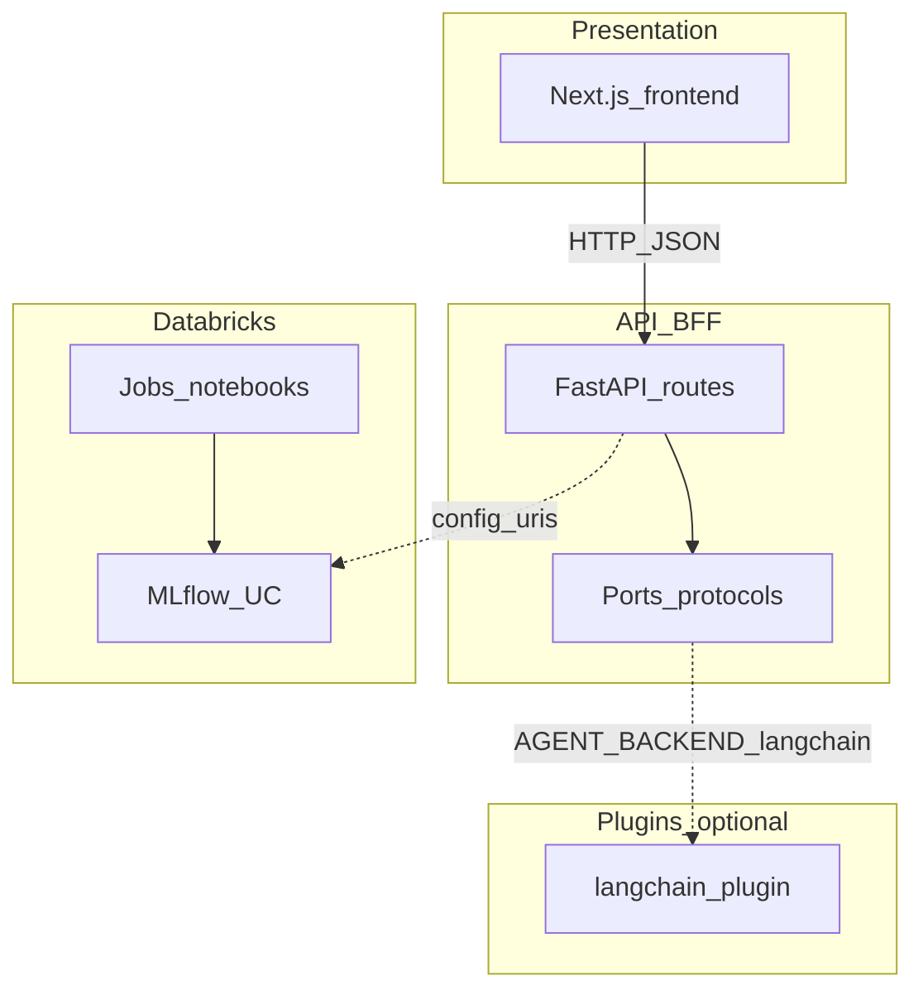

# Architecture

This document supplements the root [README.md](../README.md).

## Layer diagram

## Dependency rule

- `overfished_api` defines **ports** (protocols) in `api/src/overfished_api/ports/`.
- `overfished_langchain_plugin` implements those ports and may depend on LangChain packages **only** inside the plugin package.
- The Next.js app must not import Python packages; it only consumes HTTP + env.

## ADRs

None yet. Add `docs/adr/NNNN-title.md` when you lock a contentious decision (e.g. auth, cache store).
